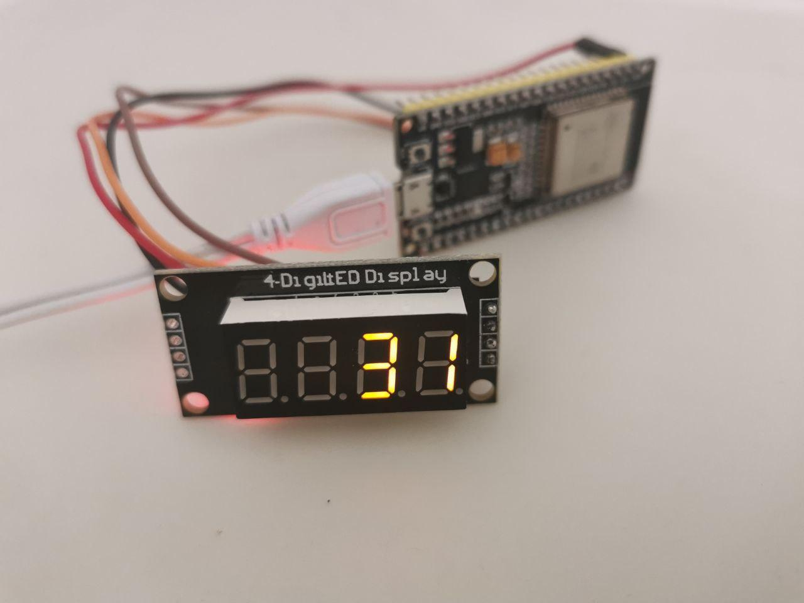

# micropython-remainigdays

ESP32-based countdown timer



It can be configured to be set via a telegram BOT (it uses the [uTelegram](https://github.com/jordiprats/micropython-utelegram) python library)

## Config

config.py

```
wifi_config = {
    'ssid':'DEMO',
    'password':'PASSW0RD'
}

utelegram_config = {
    'token': 'TOKEN',
    'masters': [ 'ADMIN_ID' ]
}
```

## Upload

```
bash upload.sh
```

## Dependencies

https://github.com/mcauser/micropython-tm1637
